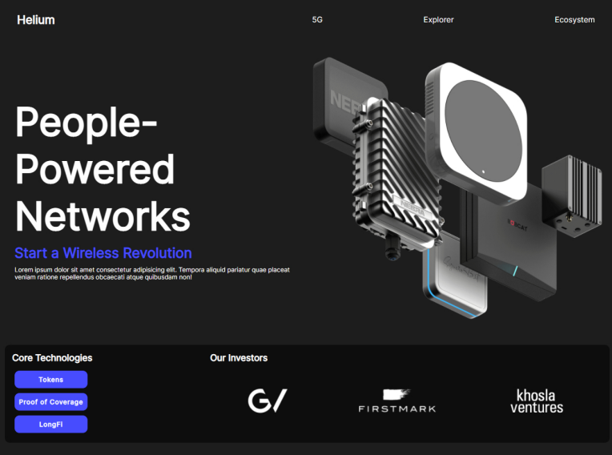

# 🚀 Helium – Challenge From Scratch

> 🧑‍🏫 Un projet réalisé dans le cadre de la formation "Développement Web" proposée par [From Scratch](https://fromscratch.podia.com/)

---

## 📌 Présentation

Ce projet est une reproduction d'une landing page inspirée du site demo **Helium**.  
Il a été conçu comme un **exercice pédagogique** pour pratiquer les bases du HTML & CSS, avec une attention particulière portée sur **Flexbox** et l'approche **desktop-first**.

---

## 🛠️ Technologies utilisées

- 💻 HTML5
- 🎨 CSS3 (avec Flexbox)
- 🧱 Responsive design (media queries)
- 🧭 Approche **desktop-first**

---

## 🎯 Objectifs pédagogiques

- Structurer une page web de manière sémantique
- Mettre en page avec **Flexbox**
- Créer un design responsive (tablette & mobile)
- Respecter les bonnes pratiques CSS

---

## 📸 Maquette



---

## 🔗 Démo en ligne

👉 [Voir la page en ligne sur GitHub Pages](https://valdesombilingo.github.io/Helium-flexbox-tp/)

---

## 📂 Lancer le projet localement

```bash
# 1. Cloner le repo
git clone https://github.com/valdesombilingo/helium-flexbox-tp.git

# 2. Ouvrir le projet
cd helium-flexbox-tp

# 3. Ouvrir index.html dans votre navigateur ou avec Live Server
```
